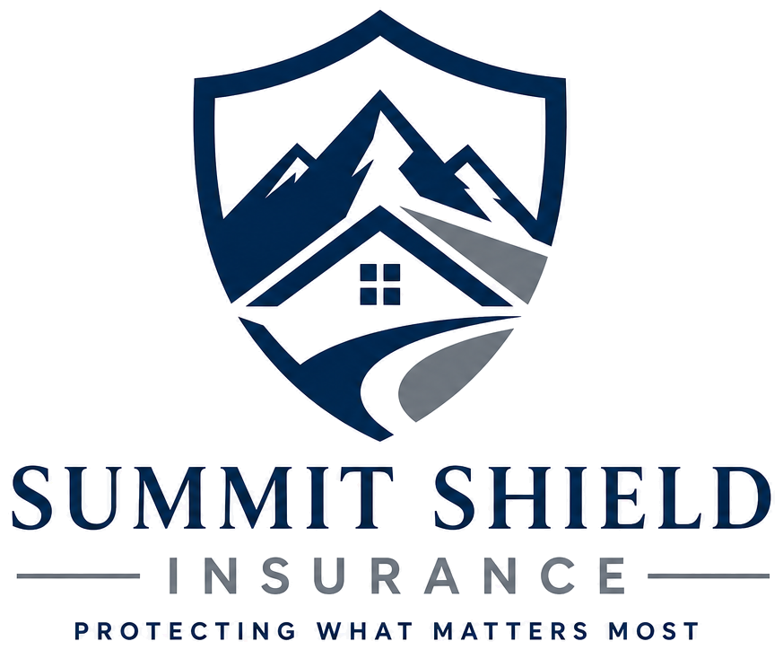

# Summit Shield Insurance — Marketing Website

A premium, conversion-focused 3-page marketing website for **Summit Shield Insurance**, built to integrate seamlessly with **GoHighLevel (GHL)**. Portfolio case study built to production-client standards.



## Structure

| File | Purpose |
|---|---|
| `index.html` | Conversion-focused homepage: hero, trust bar, problem, service cards plus five visual coverage details, comparison, process, testimonials, FAQ, and contact/consultation |
| `services.html` | Detailed Life, Health, Auto, Home, and Business coverage sections moved off the homepage for a shorter decision path |
| `privacy.html` / `terms.html` | Legal pages, linked from the footer |
| `thanks.html` | Quote form success page |
| `404.html` | Branded not-found page (Netlify serves this automatically) |
| `_redirects` | Old `/services` and `/contact` URLs redirect to the page anchors |
| `ghl-export/` | **GoHighLevel import kit** — paste-ready Custom CSS, header code, and the whole page as one Custom HTML/JS block, with instructions |

Plus `styles.css` (single stylesheet) and `script.js` (vanilla JS: mobile nav, FAQ accordion, and contact interactions).

Live site: https://summitshieldinsurance.netlify.app (auto-deploys from `main`).

**Consultation form**: the Summit Shield GoHighLevel form (`BMCvnCSHkyDRszN6VevH`) is embedded on the homepage. Both "Book a Free Consultation" and "Get a Free Quote" CTAs scroll visitors to that form.

Photography: Unsplash/Pexels-licensed stock, self-hosted in `assets/img/` with responsive 480/800/full variants (free for commercial use, no attribution required).

## Tech Constraints (by design)

- **No frameworks, no build tools** — plain HTML/CSS/JS that pastes directly into GHL
- **Vanilla JavaScript only**, wrapped in an IIFE, no dependencies
- **Single shared CSS file** compatible with GHL's site-wide Custom CSS block
- **Semantic HTML** with accessibility baked in (skip links, ARIA states, focus styles, keyboard-operable accordions/tabs)
- Fonts: **Poppins** (headings) + **Inter** (body) via Google Fonts
- Brand palette: `#0B2D5C` primary navy · `#1E5AA8` secondary blue · `#F5F7FA` background · gold accent for CTAs

## GoHighLevel Integration

### 1. Site-wide CSS
Copy the full contents of `styles.css` into **GHL → Sites → your site → Settings → Custom CSS**.

> If `@import` for Google Fonts is stripped by GHL, add the `<link>` font tags (see the comment at the top of `styles.css`) to the site's **Custom Code → Header** instead.

### 2. Page markup
Each page's `<body>` content is organized into clearly commented sections. In GHL, rebuild each page using **Custom HTML elements** — copy each commented section block as needed. Do not paste the `<html>/<head>/<body>` wrapper tags.

### 3. Form embed
The homepage already includes the GoHighLevel form iframe for **Summit Shield - Free Consultation**. If the form ever changes, replace the iframe whose `data-form-id` is `BMCvnCSHkyDRszN6VevH`.

### 4. CTA wiring
All consultation and quote CTAs point to the embedded form section (`#consultation` or `#quote`). Both anchors land on the same GoHighLevel form.

## Local preview

No build step. Open `index.html` in a browser, or serve the folder:

```bash
npx serve .
```

## Conversion strategy

Every section moves visitors toward **Book a Free Consultation** (primary) or **Get a Free Quote** (secondary). Copy follows a problem → promise → proof → process → price → testimonial → risk-reversal → urgency → FAQ → CTA narrative arc.
